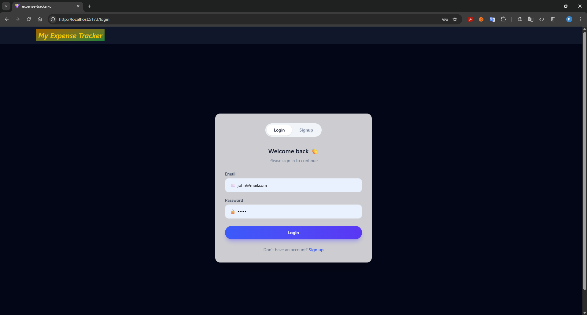
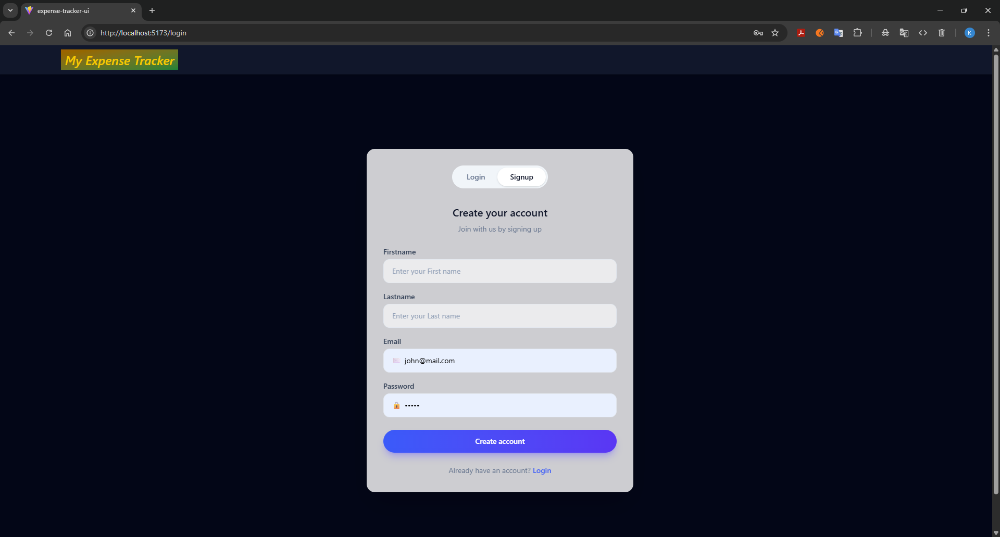
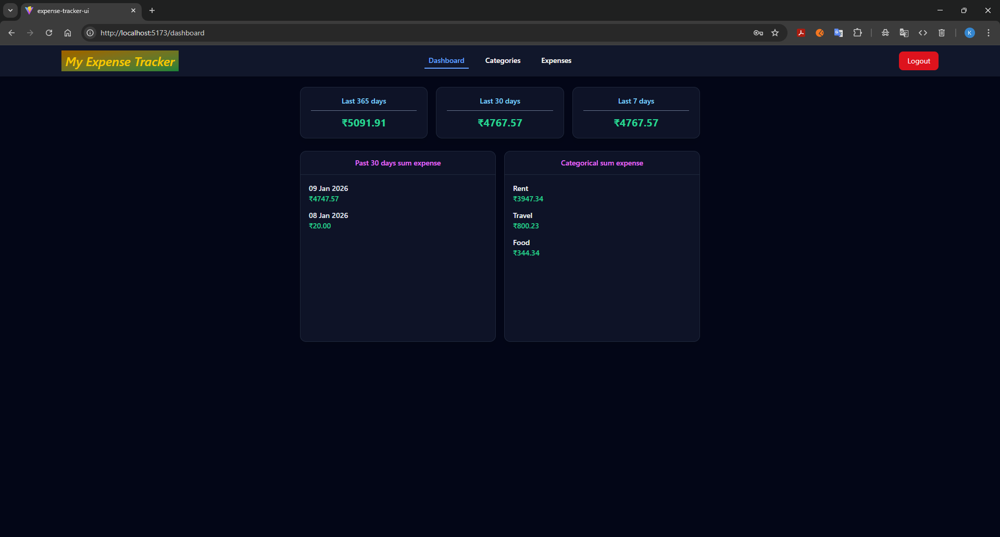
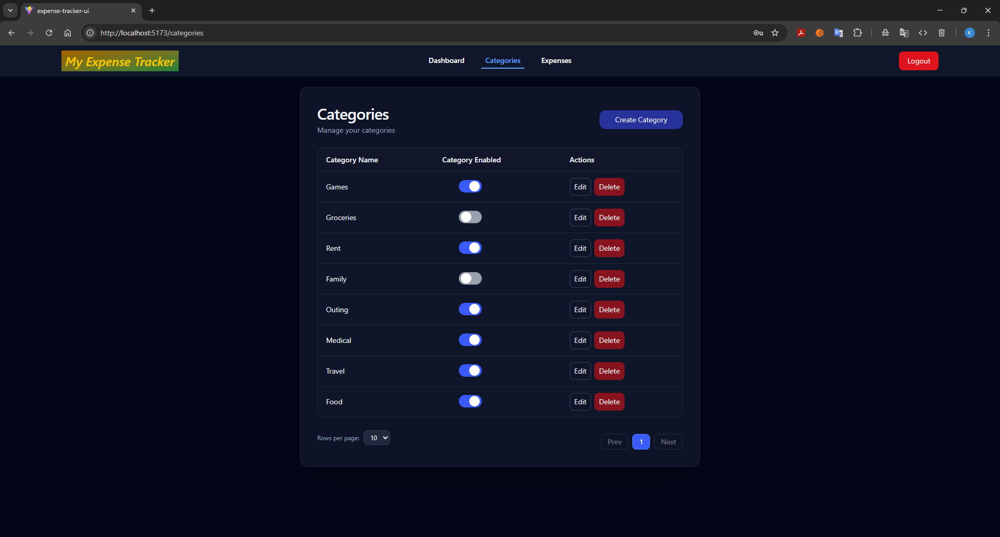
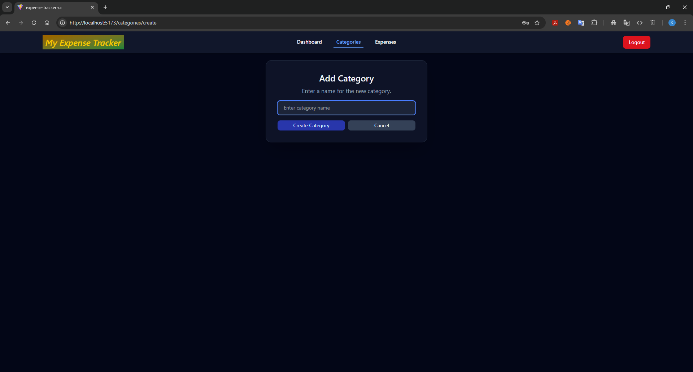
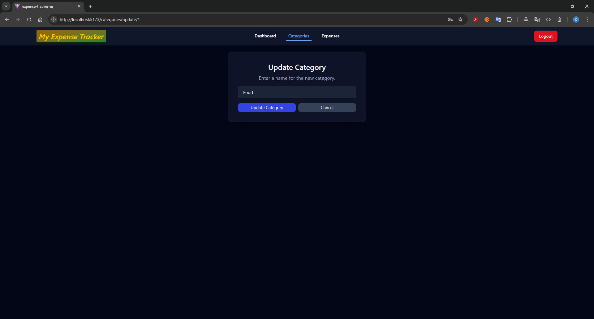
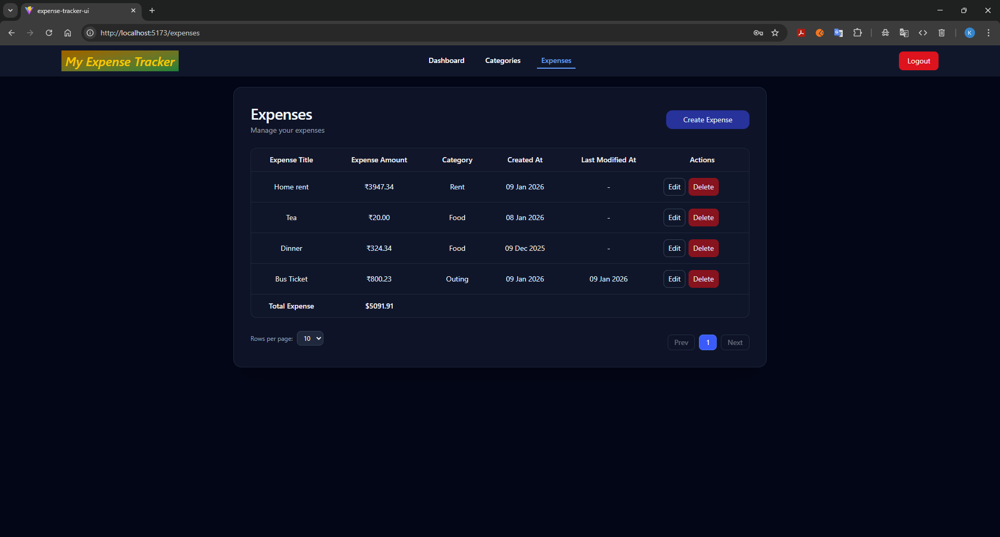
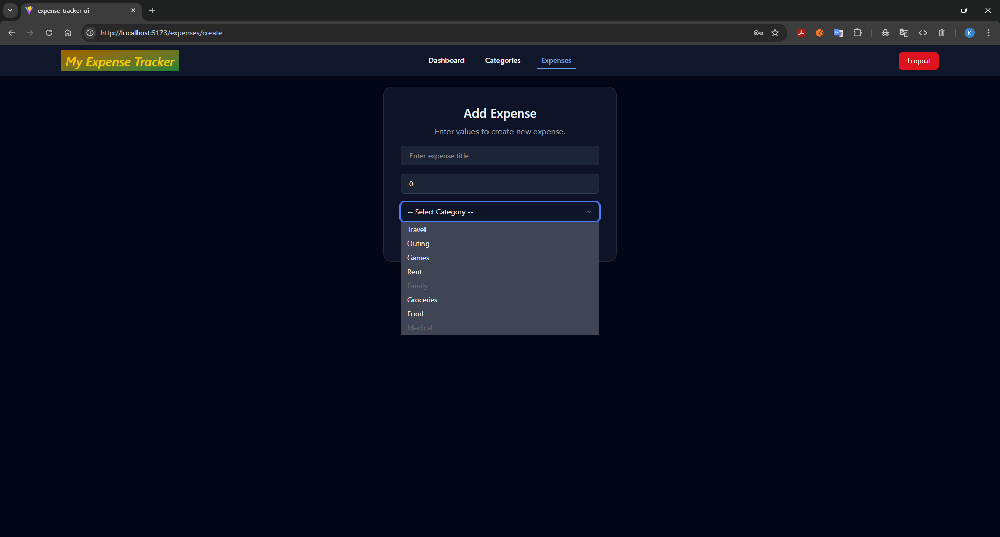
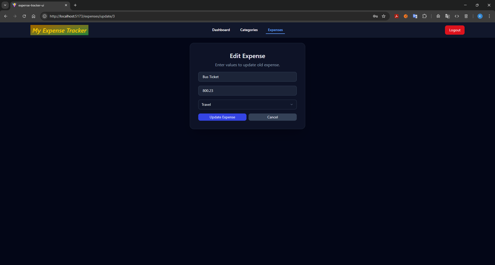
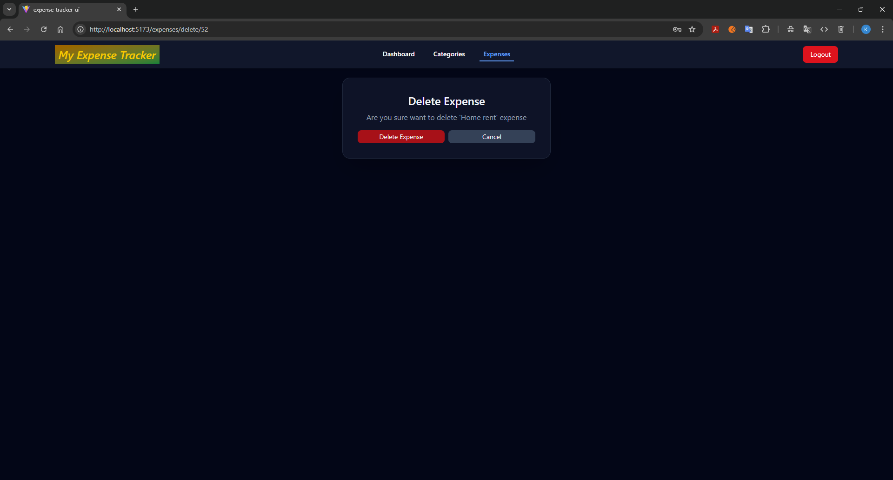

# EXPENSE-TRACKER

---

- Backend
  - Spring Boot
  - Spring Security
  - Spring Data Jpa
  - JWT (for authentication)
  - Open API
  - Docker (for database)
- Frontend
  - TypeScript
  - React
  - React Router
  - Axios
  - Tailwind CSS
- Database
  - Postgres
---

#### The following features are added in this Expense Tracker application
- This **Expense Tracker** application is used to calculate expense based on daily expense we have added.
- It will show the calculated expense of **Last 7 days**, **Last 30 days**, **Last 365 days**.
- It shows calculated sum of expense for each days in **past 30 days**.
- It shows calculated sum of expenses in each category.
- The users can add their **own categories** and add their expense relevant to their own categories.

## Application Screenshots
1. **Authentication**
   1. **Login Page**
       
   2. **Signup page**
       
2. **Dashboard**
   1. **Dashboard Page**
      
3. **Categories**
   1. **All Categories**
     
   2. **Create Category**
     
   3. **Edit Category**
     
   4. **Delete Category**
         
4. **Expenses**
   1. **All Expenses**
     
   2. **Create Expense**
     
   3. **Edit Expense**
     
   4. **Delete Expense**
     
